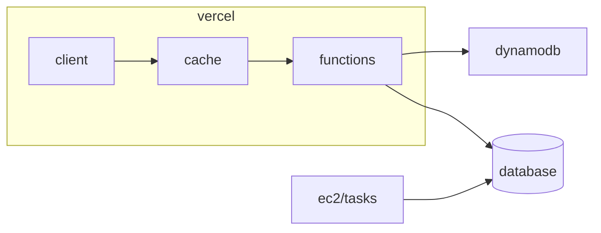

### Caching with DynamoDB

Current infrastructure:



### How it works

Our cache work as a wrapper to a function that will cache the output using the function name plus parameters as key, so if the request repeats, it will hit our cache.

We have two cache layers, dynamodb and in-memory, we are using the in-memory cache to avoid duplicate requests to dynamodb from same lambda/vercel function.

### How to use

Our cache is implemented on utilities/dynamoCache.ts, it exports a function called memoize. You will use it to wrap the function you want to cache, for instance:

```typescript
import channelIndex from ....
import { memoize } from 'utilities/dynamoCache';
....
// you need to wrap the function you want to cache
const channelIndexMemo = memoize(channelIndex);
....
// when request matches a previous request, will hit our cache
const channels = await channelIndexMemo(....);
....
```

### Dynamo DB Table

As standard we are using table names as "cache-ENV", it means, for production we are using "cache-prod". We can change it easily modifying the environment variable CACHE_TABLE.

In case we need to flush our cache, the fast way to do it is deleting the dynamoDB table and recreating it. Here is the original command used to create the dynamo table. To run this command you will need to have the aws cli set up.

```bash
$tableName=cache-staging

# this command will create a table with pk field as HASH KEY and sk field as RANGE KEY, both use string as type
# the table use on demand billing mode, it scales itself
aws dynamodb create-table \
    --table-name $tableName \
    --attribute-definitions AttributeName=pk,AttributeType=S AttributeName=sk,AttributeType=S \
    --key-schema AttributeName=pk,KeyType=HASH AttributeName=sk,KeyType=RANGE \
    --billing-mode PAY_PER_REQUEST
```

After creating the table, we need to set the TimeToLive functionality on the table. Here is how:

```bash
$tableName=cache-staging
# in this case we will use the attribute ttl as timeToLive, that means if we set an attribute "ttl" with a timestamp
# on the item that you insert, this item will be deleted when the timestamp matches new Date().getTime()/1000
aws dynamodb update-time-to-live \
    --table-name $tableName \
    --time-to-live-specification Enabled=true,AttributeName=ttl
```

For flush our cache (delete our table), we can use this command:

```bash
$tableName=cache-staging
# we can delete the table any time we want, even in production, the cache function has trycatch implemented
# to avoid any side effects to our normal behavior
aws dynamodb delete-table \
    --table-name $tableName
```
